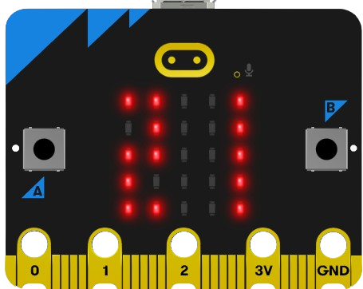

# Small font for micro:bit



Python version of the [Makecode extension "WhaleySans Font"](https://github.com/makecode-extensions/WhaleySansFont/blob/master/WhaleySansFont.ts) from the microbit/micropython Chinese community. [http://www.micropython.org.cn](http://www.micropython.org.cn)
 
Migrated to MicroPython by @javacasm 


## Usage

```python
from microbit import *
from whaley_sans_font import show_number, test_font

test_font()

# Code in a 'while True:' loop repeats forever
while True:
    show_number(temperature(),bright=7,leading_cero=False)
    sleep(1000)

```

To display a number (between 0 and 99), call 
```python
show_number(number)
```

* You can select the bright with the 'bright' parameter (9 is the default value)
* A leading 0 is added if number is smaller than 10. You can change the default behavior with the 'leading_cero=False' 